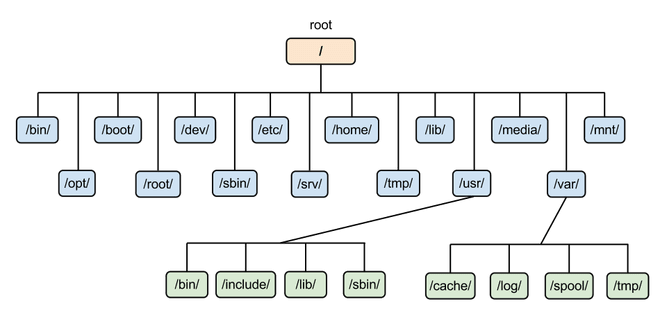

# Estructura y Sistemas de Archivos en Ubuntu

El **Sistema de Archivos** en Ubuntu (y en la mayoría de las distribuciones de Linux) sigue una jerarquía estándar conocida como **Filesystem Hierarchy Standard (FHS)**. Este sistema organiza los archivos y directorios de una manera lógica, facilitando la administración y el uso del sistema.

## Estructura del Sistema de Archivos

La **estructura de directorios** en Ubuntu comienza desde la raíz (**`/`**), que es el directorio base de todo el sistema de archivos. Todos los demás directorios y archivos cuelgan de esta **raíz**.



## Directorios Principales

- **`/` (Raíz):** El directorio raíz es el punto de partida de la jerarquía del sistema de archivos. Todos los demás directorios y archivos cuelgan de él.

- **`/bin`:** Contiene binarios (programas ejecutables) esenciales para el sistema y los usuarios. Estos programas están disponibles para todos los usuarios y son necesarios para el arranque y funcionamiento básico del sistema.
  - Ejemplos: `ls`, `cp`, `mv`, `rm`.

- **`/boot`:** Almacena los archivos necesarios para el arranque del sistema, incluyendo el cargador de arranque (`grub`), el kernel de Linux y otros archivos de configuración.
  - Ejemplos: `vmlinuz` (kernel), `initrd.img`.

- **`/dev`:** Contiene archivos de dispositivos, que son interfaces para los dispositivos de hardware y periféricos del sistema.
  - Ejemplos: `sda` (disco duro), `tty` (terminal).

- **`/etc`:** Directorio que almacena archivos de configuración del sistema. La configuración global de aplicaciones y servicios se encuentra aquí.
  - Ejemplos: `passwd` (usuarios del sistema), `hosts` (nombres de host y direcciones IP).

- **`/home`:** Directorio que contiene los directorios personales de los usuarios. Cada usuario tiene su propio subdirectorio donde puede almacenar archivos y configuraciones personales.
  - Ejemplo: `/home/usuario`.

- **`/lib`:** Contiene las bibliotecas esenciales compartidas utilizadas por los binarios en `/bin` y `/sbin`.
  - Ejemplos: `libc.so.6` (biblioteca C estándar).

- **`/media`:** Punto de montaje temporal para dispositivos de almacenamiento extraíbles como CD, DVD, y USB.
  - Ejemplo: `/media/cdrom`.

- **`/mnt`:** Punto de montaje temporal para sistemas de archivos.
  - Ejemplo: `/mnt/backup`.

- **`/opt`:** Contiene paquetes de software opcionales instalados manualmente. Es utilizado para aplicaciones adicionales que no forman parte del sistema base.
  - Ejemplo: `/opt/vscode`.

- **`/proc`:** Sistema de archivos virtual que proporciona información sobre los procesos en ejecución y el estado del kernel.
  - Ejemplo: `/proc/cpuinfo` (información de la CPU).

- **`/root`:** Directorio personal del usuario root (administrador del sistema). Similar a `/home` pero exclusivo para root.
  - Ejemplo: `/root/.bashrc`.

- **`/run`:** Contiene archivos de estado y datos temporales sobre el sistema desde el último arranque.
  - Ejemplo: `/run/lock`.

- **`/sbin`:** Contiene binarios ejecutables esenciales para la administración del sistema. Solo los administradores del sistema pueden ejecutar estos programas.
  - Ejemplos: `fdisk`, `fsck`, `reboot`.

- **`/srv`:** Contiene datos específicos para servicios proporcionados por el sistema, como servidores web o FTP.
  - Ejemplo: `/srv/www` (datos del servidor web).

- **`/sys`:** Sistema de archivos virtual que proporciona información y control sobre los dispositivos y controladores del kernel.
  - Ejemplo: `/sys/class/net` (información de la red).

- **`/tmp`:** Directorio para almacenar archivos temporales que pueden ser creados por aplicaciones y usuarios. El contenido suele eliminarse al reiniciar el sistema.
  - Ejemplo: `/tmp/sessionid`.

- **`/usr`:** Contiene software y datos que no son esenciales para el arranque del sistema, pero que son necesarios para el funcionamiento del usuario.
  - **`/usr/bin`:** Binarios ejecutables para aplicaciones de usuario.
  - **`/usr/lib`:** Bibliotecas para aplicaciones de usuario.
  - **`/usr/share`:** Datos compartidos, como documentación y archivos de configuración.

- **`/var`:** Contiene archivos que se espera que cambien de tamaño o contenido durante la operación del sistema, como archivos de registro y datos de las aplicaciones.
  - **`/var/log`:** Archivos de registro del sistema.
  - **`/var/spool`:** Datos en cola, como trabajos de impresión o correo.

## Sistemas de Archivos en Ubuntu

Un **sistema de archivos** es una forma de organizar y almacenar archivos en un dispositivo de almacenamiento, como un disco duro o una unidad USB. Ubuntu admite varios sistemas de archivos, cada uno con sus características y usos específicos.

### ext4 (Fourth Extended Filesystem)
- **Descripción:** Es el sistema de archivos predeterminado en muchas distribuciones de Linux, incluyendo Ubuntu. Es conocido por su rendimiento, escalabilidad y robustez.
- **Características:**
  - Soporta volúmenes de gran tamaño.
  - Mejora el rendimiento en comparación con sus predecesores (**ext2, ext3**).
  - Funciones como el **journaling** (registro de cambios) para mejorar la integridad de los datos.
- **Ejemplo de uso:** Al instalar Ubuntu, el sistema de archivos raíz generalmente se formatea como **ext4**.

### Btrfs (B-tree Filesystem)
- **Descripción:** Diseñado para ofrecer características avanzadas y alta confiabilidad, es adecuado para sistemas con grandes volúmenes de datos.
- **Características:**
  - Soporte para instantáneas (snapshots) y copias de seguridad en tiempo real.
  - Compresión transparente de datos.
  - Gestión eficiente de volúmenes.
- **Ejemplo de uso:** Utilizado en servidores y entornos que requieren gestión avanzada de datos y copias de seguridad.

### XFS
- **Descripción:** Sistema de archivos de alto rendimiento, especialmente adecuado para sistemas con grandes archivos y volúmenes.
- **Características:**
  - Soporte para volúmenes de gran tamaño.
  - Excelente rendimiento en escritura y lectura de archivos grandes.
  - Funcionalidades de **journaling**.
- **Ejemplo de uso:** Frecuentemente utilizado en servidores y estaciones de trabajo que manejan grandes cantidades de datos.

### ZFS (Zettabyte File System)
- **Descripción:** Un sistema de archivos avanzado que proporciona alta integridad de datos y características avanzadas de gestión.
- **Características:**
  - Soporte para almacenamiento de gran capacidad (zettabytes).
  - Funciones avanzadas como instantáneas, clones y compresión.
  - Integridad de datos mediante sumas de verificación.
- **Ejemplo de uso:** Utilizado en entornos que requieren alta integridad de datos y gestión avanzada, como servidores y sistemas de almacenamiento en red (NAS).

### VFAT (FAT32)
- **Descripción:** Sistema de archivos compatible con múltiples sistemas operativos, incluyendo Windows.
- **Características:**
  - Soporte para ser montado y utilizado en diferentes sistemas operativos.
  - Limitaciones en el tamaño de archivos y volúmenes.
- **Ejemplo de uso:** Utilizado en unidades USB y discos duros externos para asegurar la compatibilidad entre diferentes sistemas operativos.

### NTFS (New Technology File System)
- **Descripción:** Sistema de archivos desarrollado por Microsoft, utilizado en sistemas Windows.
- **Características:**
  - Soporte para volúmenes y archivos de gran tamaño.
  - Funcionalidades avanzadas como permisos de archivos y compresión.
- **Ejemplo de uso:** Acceso y uso de particiones de Windows en un sistema dual-boot con Ubuntu.

## Montaje de Sistemas de Archivos

El montaje es el proceso de hacer que un sistema de archivos esté disponible para su uso en el sistema operativo. En Linux, se utiliza el comando `mount` para montar sistemas de archivos.

### Ejemplo de Montaje de un Sistema de Archivos

- **Crear un punto de montaje:**
   ```bash
   sudo mkdir /mnt/mi_unidad
   ```

- **Montar un dispositivo (por ejemplo, `/dev/sdb1`):**
   ```bash
   sudo mount /dev/sdb1 /mnt/mi_unidad
   ```

- **Desmontar el dispositivo:**
   ```bash
   sudo umount /mnt/mi_unidad
   ```

### Resumen

La estructura de directorios en Ubuntu está organizada de manera lógica siguiendo el estándar FHS, lo que facilita la administración del sistema. Además, Ubuntu admite varios sistemas de archivos, cada uno adecuado para diferentes usos y necesidades. Conocer la estructura y los sistemas de archivos es escencial para gestionar y mantener el sistema de manera eficiente.